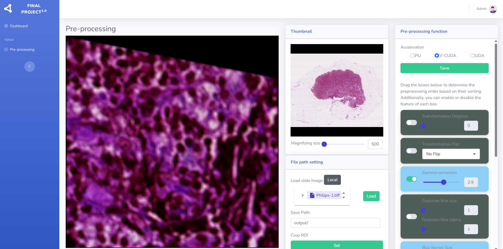
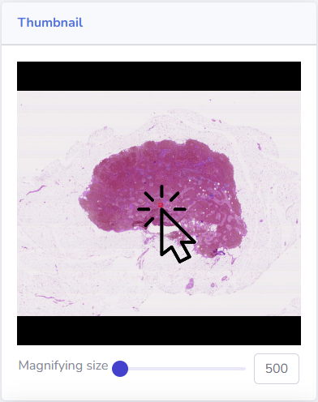
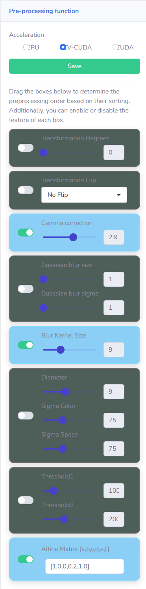

# 大型醫療影像檢視與處理平台

這是一個前後端分離的專案，旨在提供一個能夠處理、檢視並分析大型醫療影像（如病理切片）的平台。

## 功能特色

*   **高效能影像處理**：後端使用 OpenSlide 來處理大型影像檔案，支援多種格式（如 `.svs`, `.tiff`, `.dcm`）。
*   **互動式前端介面**：前端採用 Blazor Server 技術，提供流暢的 Deep Zoom Image (DZI) 體驗，讓使用者可以輕鬆縮放及平移高解析度影像。
*   **影像前處理**：支援對特定影像區域進行前處理，並可透過 CUDA 加速運算。
*   **跨平台支援**：應用程式的設定考慮了 Windows 和非 Windows（Linux/macOS）環境。

## 技術棧

*   **後端**：
    *   Python 3
    *   Flask
    *   OpenSlide
    *   Pillow, OpenCV, NumPy (用於影像處理)
    *   PyDicom, highdicom (用於 DICOM 檔案處理)
*   **前端**：
    *   .NET 6 (或更高版本)
    *   Blazor Server
    *   Radzen Blazor Components (用於 UI)

---

## 環境設定與安裝

### 1. 專案結構

```
.
├── api/         # Python Flask 後端
├── frontend/    # .NET Blazor 前端
└── slides/      # 存放大型影像檔案
```

### 2. 後端設定 (Python)

1.  **安裝相依套件**：
    建議您建立一個 Python 虛擬環境。雖然專案中未提供 `requirements.txt`，但您可以透過以下指令安裝必要的套件：

    ```bash
    pip install Flask openslide-python Pillow opencv-python numpy pydicom highdicom
    ```

    **注意**：安裝 `openslide-python` 之前，您可能需要在您的作業系統上安裝 OpenSlide C 函式庫。請參考 [OpenSlide 官方網站](https://openslide.org/download/) 的說明。

2.  **設定影像路徑**：
    後端 API 會從特定目錄讀取影像檔案。請開啟 [`api/config.py`](api/config.py) 檔案，並修改 `FILE_ROOT` 的值，使其指向您存放大型影像的 `slides` 資料夾的絕對路徑。

    ```python
    # api/config.py
    # 將路徑修改為您本機的絕對路徑
    FILE_ROOT = '/path/to/your/project/slides/'
    ```

### 3. 前端設定 (.NET)

1.  **安裝 .NET SDK**：
    請確認您已安裝 .NET 6 或更高版本的 SDK。

2.  **設定 API 位址**：
    前端應用程式需要知道後端 API 的位址。請開啟 [`frontend/FLBlazorApp/Data/FLAPIConfig.cs`](frontend/FLBlazorApp/Data/FLAPIConfig.cs) 檔案。

    *   `ImgServer_HOST`：這個變數定義了後端影像處理 API 的位址。如果您在本地端執行，預設的 `http://localhost:64656/...` 應該是正確的。如果您將後端部署在不同的機器上，請修改此處的 IP 位址和連接埠。

---

## 如何執行

### 1. 啟動後端 API

在終端機中，進入 `api` 資料夾，並執行 `app.py`：

```bash
cd api
python app.py
```

成功啟動後，您應該會看到 Flask 伺服器在 `0.0.0.0:64656` 上運行的訊息。

### 2. 啟動前端應用程式

開啟另一個終端機，進入 `frontend/FLBlazorApp` 資料夾，並執行 .NET 應用程式：

```bash
cd frontend/FLBlazorApp
dotnet run
```

成功啟動後，Blazor 應用程式會在本機的一個連接埠上運行（通常是 `http://localhost:5000` 或類似位址）。請在瀏覽器中開啟該網址。

---

## 如何重現實驗

本平台的核心功能是載入、顯示並處理大型影像。您可以透過以下步驟重現主要的使用流程：

1.  **準備影像**：
    將您要測試的大型影像檔案（如 `.tiff`, `.svs` 或 `.dcm`）放入專案根目錄下的 `slides` 資料夾。

    您可以從 OpenSlide 的測試資料網站下載範例檔案，例如 Philips-TIFF：
    [https://openslide.cs.cmu.edu/download/openslide-testdata/Philips-TIFF/](https://openslide.cs.cmu.edu/download/openslide-testdata/Philips-TIFF/)

2.  **開啟前端介面**：
    在瀏覽器中開啟前端應用程式的網址。

3.  **載入影像**：
    前端介面應提供一個檔案瀏覽器或上傳功能。選擇您放在 `slides` 資料夾中的影像檔案。此操作會觸發對後端 `loadImage` API 的呼叫。後端會處理影像，並回傳縮圖及影像基本資訊給前端顯示。

<table>
<tr>
<td valign="top">

4.  **互動式檢視與處理**：
    *   **區域選取與處理**：在前端顯示縮圖介面上用滑鼠點擊選取一個感興趣的區域 (Region of Interest, ROI)。此操作會呼叫後端的 `getRegion` API，傳送所選區域的座標和大小。後端會擷取該區域，進行前處理（如果設定了 CUDA，會嘗試使用 GPU 加速），並將處理後的影像回傳給前端顯示。


</td>
<td valign="top">



</td>
</tr>
</table>

透過以上步驟，您可以完整體驗從載入影像到互動式分析的整個流程。

---

## 效能測試

專案中包含一個效能測試腳本 `api/benchmark.py`，可用於評估不同影像處理任務在 CPU、OpenCV CUDA 及 PyCUDA 上的執行效能。

### 如何執行測試

在終端機中，進入 `api` 資料夾，並執行 `benchmark.py`：

```bash
cd api
python benchmark.py [OPTIONS]
```

### 命令列選項

您可以透過以下命令列選項來自訂測試行為：

*   `--width <整數>`：設定測試影像的寬度。若提供 `--image_path`，此選項會將該圖片縮放至指定寬度。
*   `--height <整數>`：設定測試影像的高度。若提供 `--image_path`，此選項會將該圖片縮放至指定高度。
*   `--image_path <路徑>`：指定要用於測試的圖片檔案路徑。若不提供此選項，腳本會自動生成一張漸層圖片進行測試。

### 測試範例

1.  **使用預設設定執行測試**：
    （將生成一張 500x500 的漸層圖片）
    ```bash
    python benchmark.py
    ```

2.  **使用自訂尺寸的生成圖片進行測試**：
    ```bash
    python benchmark.py --width 1024 --height 768
    ```

3.  **使用專案內附的測試圖片**：
    `api` 資料夾內附有 `slide_500.png` (500x500) 和 `slide_5000.png` (5000x5000) 兩張圖片可供測試。
    ```bash
    # 使用 500x500 的圖片
    python benchmark.py --image_path slide_500.png

    # 使用 5000x5000 的圖片
    python benchmark.py --image_path slide_5000.png
    ```

4.  **使用外部圖片並縮放至指定尺寸**：
    ```bash
    python benchmark.py --image_path /path/to/your/large_image.tiff --width 800 --height 600
    ```

### 測試結果範例

以下是使用一張 5000x5000 的影像 (`slide_5000.png`) 進行測試的結果，以展示不同加速模式的效能差異。

**執行指令：**
```bash
python benchmark.py --image_path slide_5000.png
```

**輸出結果：**
```
==================== 測試任務: Blur (加速: CPU, 最終尺寸: 5000x5000) ====================
參數: {'blur_size': 15}
--- 執行 CPU/OpenCV 版本 (由 preprocessing 模組自動選擇) ---
[CPU] apply_mean_blur - Time: 396.034 ms
耗時: 1316.097 ms

==================== 測試任務: Blur (加速: CVCUDA, 最終尺寸: 5000x5000) ====================
參數: {'blur_size': 15}
--- 執行 CPU/OpenCV 版本 (由 preprocessing 模組自動選擇) ---
[OpenCV CUDA] apply_mean_blur_opencv_cuda - Time: 6.909 ms
耗時: 1026.665 ms

==================== 測試任務: Blur (加速: PyCUDA, 最終尺寸: 5000x5000) ====================
參數: {'blur_size': 15}
--- 執行 PyCUDA 版本 ---
[PyCUDA] apply_mean_blur_pycuda - Time: 4.203 ms
耗時: 1074.031 ms

--- 結果比較 ---
  - ✅ 圖像完全一致: CPU vs OpenCV CUDA
  - ✅ 圖像完全一致: CPU vs PyCUDA
  - ✅ 圖像完全一致: OpenCV CUDA vs PyCUDA
```

**結果分析：**
從日誌中可以清楚看到，對於 5000x5000 的高解析度影像，單純的 `Blur` 核心運算時間：
*   **CPU**: 約 396 ms
*   **OpenCV CUDA**: 約 6.9 ms
*   **PyCUDA**: 約 4.2 ms

這顯示了使用 GPU (無論是 OpenCV CUDA 還是 PyCUDA) 進行加速，其運算速度遠遠超過僅使用 CPU 的情況。雖然總耗時 (`耗時: ...`) 還包含了圖片編解碼等其他開銷，但在核心運算上，效能提升是顯而易見的。
